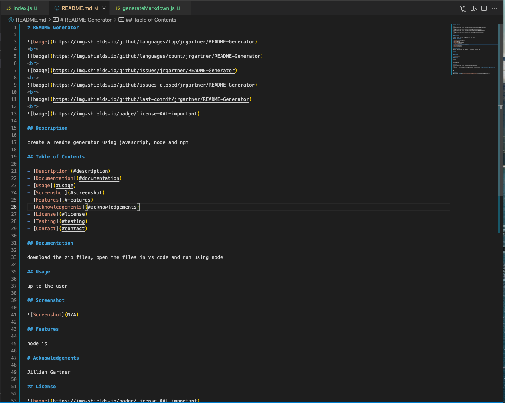

# README Generator

 

 

 

 

 

## Description

create a readme generator using javascript, node and npm

## Table of Contents

- [Description](#description)
- [Documentation](#documentation)
- [Usage](#usage)
- [Screenshot](#screenshot)
- [Features](#features)
- [Acknowledgements](#acknowledgements)
- [License](#license)
- [Testing](#testing)
- [Contact](#contact)

## Documentation

download the zip files, open the files in vs code and run using node

## Usage

up to the user

## Screenshot

## Features

node js

# Acknowledgements

Jillian Gartner

## License

 
Permission to use this application is granted under the AAL license. <https://opensource.org/licenses/AAL>

## Testing

N/A

## Contact:

Holler at me! <a href="mailto:jillianrosegartner@gmail.com">jillianrosegartner@gmail.com</a>
